```mermaid
flowchart TD

    START(["FACIAL PALSY - CN VII"])

    START --> ONSET{"Onset?"}
    START --> AET{"Aetiology?"}
    START --> HBGRADE["`**House-Brackmann Grading**
Grade I - Normal function
Grade II - Mild dysfunction
Grade III - Moderate dysfunction
Grade IV - Moderately severe
Grade V - Severe dysfunction
Grade VI - Total paralysis`"]

    %% ─── ONSET PATHWAY ───────────────────────────────────────────
    ONSET -->|Immediate onset| COMP{"Completeness?"}
    ONSET -->|Delayed - more than 1 hour| DELAY["`**Delayed Onset**
Excellent prognosis
Mechanism: neural oedema or haematoma
Neural continuity preserved`"]

    DELAY --> CONS
    COMP -->|Incomplete - HB Grade II to V| CONS
    COMP -->|Complete - HB Grade VI| INVPATH

    %% ─── CONSERVATIVE MANAGEMENT ────────────────────────────────
    CONS["Conservative Management"]
    CONS --> ST["`Steroids
Prednisolone 1 mg per kg per day
1 to 3 weeks with taper`"]
    CONS --> EC["`Eye Care
Lubricants and moisture chamber
Tape eyelid at night`"]
    CONS --> OBSV["Serial Clinical Observation"]

    %% ─── INVESTIGATIONS ──────────────────────────────────────────
    INVPATH["Immediate Complete Palsy - Investigate"]
    INVPATH --> HRCT["`HRCT Temporal Bone
Fracture line
Fallopian canal involvement`"]
    INVPATH --> TOPODT["Topodiagnostic Tests - Localise level of lesion"]
    INVPATH --> ENOG["`ENoG - Electroneuronography
Useful: Day 3 to Day 14 only
CMAP amplitude vs normal side`"]

    %% ─── TOPODIAGNOSTIC TESTS ────────────────────────────────────
    TOPODT --> TP1["`Schirmer Test - GSPN
Geniculate ganglion level
Abnormal: more than 75pct reduction in lacrimation`"]
    TOPODT --> TP2["`Stapedial Reflex - Nerve to stapedius
Absent = lesion at or above stapedius`"]
    TOPODT --> TP3["`Taste and Salivary Flow - Chorda tympani
Abnormal = lesion above chorda`"]

    TP1 --> LOCLGC["Geniculate level: Schirmer + Stapedial + Taste all abnormal"]
    TP2 --> LOCSTAP["Between Geniculate and Stapedius: Normal lacrimation only"]
    TP3 --> LOCCHOR["Between Stapedius and Chorda: Normal lacrimation and stapedial"]

    %% ─── ENOG DECISION ───────────────────────────────────────────
    ENOG --> ENRES{"ENoG Result?"}
    ENRES -->|Less than 90pct degeneration| CONS
    ENRES -->|90pct or more within 6 days| SXIND
    ENRES -->|No response - or after 3 weeks| EMGTEST

    %% ─── EMG DECISION ────────────────────────────────────────────
    EMGTEST["`EMG - Electromyography
Motor unit potentials
Orbicularis oculi and oris`"]
    EMGTEST --> EMRES{"EMG Finding?"}
    EMRES -->|Polyphasic potentials| POLYPH["`Regeneration Occurring
Surgery NOT indicated
Conservative - observe`"]
    EMRES -->|Fibrillation potentials| SXIND
    EMRES -->|Electrical silence| REAN["`Facial Reanimation
Motor end plates lost
Static or dynamic procedure`"]

    %% ─── AETIOLOGY BRANCHES ─────────────────────────────────────
    AET -->|Temporal bone fracture| TBF
    AET -->|CSOM - Cholesteatoma| CSOMN
    AET -->|Acute Otitis Media| AOMN
    AET -->|Post mastoid surgery| POSTOP

    %% ─── TRAUMATIC BRANCH ───────────────────────────────────────
    TBF["`Traumatic Palsy
FN palsy in 7pct of TB fractures
66pct at geniculate ganglion`"]
    TBF --> TTYPE{"Fracture type and hearing?"}
    TTYPE -->|Longitudinal - hearing preserved| MFA["Middle Fossa Approach"]
    TTYPE -->|Transverse - hearing preserved| MFTM["Middle Fossa plus Transmastoid"]
    TTYPE -->|Profound SNHL - any type| TLA["Translabyrinthine Approach"]
    MFA --> SXIND
    MFTM --> SXIND
    TLA --> SXIND

    %% ─── CSOM BRANCH ────────────────────────────────────────────
    CSOMN["`CSOM-related Palsy
Cholesteatoma erosion
Fallopian canal osteitis`"]
    CSOMN --> CSO1["CT Scan - Fallopian canal erosion"]
    CSO1 --> CSO2["Mastoidectomy and FN Decompression"]
    CSO2 -->|Nerve intact but compressed| DECO["Decompression Only"]
    CSO2 -->|More than 50pct circumference disrupted| REPAR["Repair - suture or inlay graft"]
    CSO2 -->|Transected| GRAFTN["Anastomosis or Interposition Nerve Graft"]

    %% ─── AOM BRANCH ─────────────────────────────────────────────
    AOMN["`AOM-related Palsy
Inflammatory oedema and toxins
Fallopian canal dehiscence`"]
    AOMN --> AOMTX["IV Antibiotics and Steroids"]
    AOMTX --> MYRING["Myringotomy and Ventilation Tube"]
    MYRING --> AOMOUT["Good prognosis - surgery rarely needed"]

    %% ─── POST-MASTOID BRANCH ────────────────────────────────────
    POSTOP["`Post-operative Palsy
Incidence: 0.6 to 3.6pct
Most common site: distal tympanic segment`"]
    POSTOP --> PMTYPE{"Type of palsy?"}
    PMTYPE -->|Possibly local anaesthetic effect| OBSWAIT["Observe 2 to 4 hours - remove tight dressing"]
    PMTYPE -->|Incomplete palsy| STEROPO["Oral Steroids and Observation"]
    PMTYPE -->|Complete immediate| REEXPL["HRCT and Plan Re-exploration"]
    PMTYPE -->|Delayed onset days later| VIRAL["Steroids and Acyclovir - HSV/VZV reactivation"]
    OBSWAIT --> STEROPO
    STEROPO -->|Progresses to complete| REEXPL

    %% ─── SURGICAL TECHNIQUE ─────────────────────────────────────
    SXIND["Surgical Exploration Indicated"]
    SXIND --> SXFIND{"Intra-operative Finding?"}
    SXFIND -->|Compressed or oedematous| SDEC["Decompression of Fallopian Canal"]
    SXFIND -->|Crushed but in continuity| SANA["Primary End-to-End Anastomosis"]
    SXFIND -->|Transected with gap| SGRAFT["`Interposition Nerve Graft
Great auricular or sural nerve
Axonal regrowth: 1 mm per day`"]

    %% ─── OUTCOMES ───────────────────────────────────────────────
    SDEC --> OUT1(["Expected HB I to II - Full or near-full recovery"])
    DECO --> OUT1
    POLYPH --> OUT1
    AOMOUT --> OUT1
    SANA --> OUT2(["Partial Recovery - HB II to III"])
    REPAR --> OUT2
    SGRAFT --> OUT3(["Partial Recovery - HB III to IV - months to years"])
    GRAFTN --> OUT3
    REAN --> OUT4(["Static sling or Dynamic reanimation procedure"])

    %% ─── STYLING ─────────────────────────────────────────────────
    classDef startNode    fill:#1e40af,stroke:#1e3a8a,color:#ffffff,font-weight:bold
    classDef decision     fill:#fef3c7,stroke:#d97706,color:#1c1917,font-weight:bold
    classDef conservative fill:#dcfce7,stroke:#16a34a,color:#14532d
    classDef investigate  fill:#dbeafe,stroke:#3b82f6,color:#1e3a5f
    classDef aetiology    fill:#ede9fe,stroke:#7c3aed,color:#3b0764
    classDef surgical     fill:#fee2e2,stroke:#dc2626,color:#7f1d1d,font-weight:bold
    classDef outcome      fill:#ecfdf5,stroke:#059669,color:#064e3b
    classDef grading      fill:#f0f9ff,stroke:#0284c7,color:#0c4a6e

    class START startNode
    class ONSET,COMP,ENRES,EMRES,AET,TTYPE,PMTYPE,SXFIND decision
    class CONS,ST,EC,OBSV,DELAY,POLYPH,AOMOUT,VIRAL,OBSWAIT,STEROPO conservative
    class INVPATH,HRCT,TOPODT,TP1,TP2,TP3,LOCLGC,LOCSTAP,LOCCHOR,ENOG,EMGTEST investigate
    class TBF,CSOMN,AOMN,POSTOP,MFA,MFTM,TLA,CSO1,CSO2,AOMTX,MYRING,REEXPL aetiology
    class SXIND,SXFIND,SDEC,SANA,SGRAFT,DECO,REPAR,GRAFTN surgical
    class OUT1,OUT2,OUT3,OUT4,REAN outcome
    class HBGRADE grading
```

---
tags:
  - paper1
  - otology
  - facial-nerve
  - flowchart
---

# Facial Nerve Injury — Management Flowchart

**Source:** Scott-Brown's Otorhinolaryngology, 8th Edition — Volume 2, Chapter 112 (The Facial Nerve and Its Non-Neoplastic Disorders), Chapter 91 (Ear Trauma)

---

---

> [!abstract] Reading the Flowchart
> - **Yellow diamonds** — Decision points
> - **Blue nodes** — Investigations and topodiagnostic localisation
> - **Green nodes** — Conservative management and good prognosis paths
> - **Red nodes** — Surgical indication and technique
> - **Purple nodes** — Aetiology-specific management pathways
> - **Teal nodes** — Expected outcomes

---

*See also: [[Facial Nerve]] — full anatomy, grading, ENoG/EMG and management text; [[Facial Nerve Monitoring]] — intra-operative monitoring*
